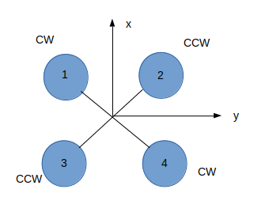
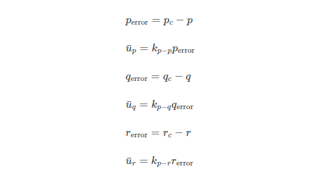
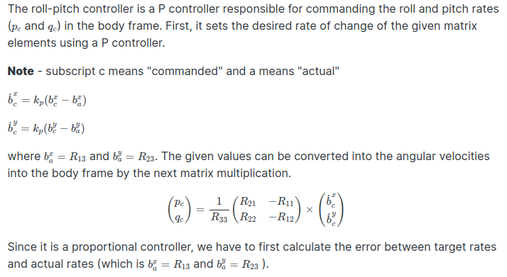
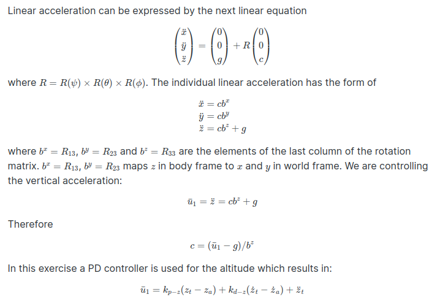
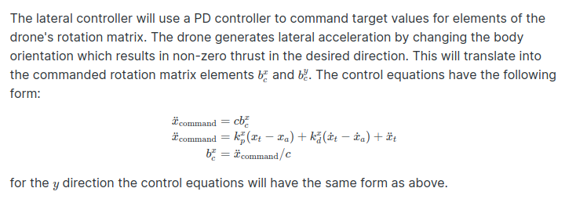
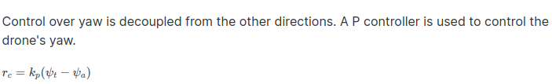

## Implementing a c++ controller 

The optimial order of implementaion of controllers is :
1. Body-rate controller
2. Roll-pitch controller
3. Altitude controller
4. Lateral controller
5. Yaw controller (this one is more independent so we can keep it at last)

This is because we tune the inner controllers first, since the outer loop controllers depend on the inner loop controllers to do their job.


### 1. Motor Commands



```
  float l = L / sqrt(2.0f); //Distance from rotor (body frame not aligned with arms)
  float Fx = momentCmd.x / l; // using moment euqation
  float Fy = momentCmd.y / l;
  float Fz = -1 * (momentCmd.z / kappa); // negative because of bug in simulator code

  // Note that the rotors 3 and 4 are flipped from what is shown in the lesson (rear left and rear)
  cmd.desiredThrustsN[0] = 0.25f * (collThrustCmd + Fx + Fy + Fz); // front left
  cmd.desiredThrustsN[1] = 0.25f * (collThrustCmd - Fx + Fy - Fz); // front right
  cmd.desiredThrustsN[2] = 0.25f * (collThrustCmd + Fx - Fy - Fz); // rear left
  cmd.desiredThrustsN[3] = 0.25f * (collThrustCmd - Fx - Fy + Fz); // rear right
```


### 2. BodyRate Controller

The commanded roll, pitch, and yaw are collected by the body rate controller, and they are translated into the desired rotational accelerations along the axis in the body frame. 
```
kpPQR = 85, 93, 5
```



```
  V3F pqr_err = pqrCmd - pqr;

  V3F moment_of_inertia;
  moment_of_inertia.x = Ixx;
  moment_of_inertia.y = Iyy;
  moment_of_inertia.z = Izz;
  
  momentCmd = pqr_err * moment_of_inertia * kpPQR;

```


### 3. RollPitch Controller



```
kpPQR = 85, 93, 5
```

```
  // Get acceleration z , negative upwards
  float c = -1 * (collThrustCmd / mass );
  // Constrain tilt angles ?
  float b_x_c = CONSTRAIN(accelCmd.x / c, -maxTiltAngle, maxTiltAngle);
  float b_y_c  = CONSTRAIN(accelCmd.y / c, -maxTiltAngle, maxTiltAngle);
  float b_x_a = R(0, 2);
  float b_y_a = R(1, 2);
  float b_x_c_dot = kpBank * (b_x_c - b_x_a);
  float b_y_c_dot = kpBank * (b_y_c - b_y_a);

  //Return roll and pitch rates (p_c and q_c)
  float p_c = ((R(1,0) * b_x_c_dot) - (R(0,0) * b_y_c_dot))/R(2,2);
  float q_c = ((R(1,1) * b_x_c_dot) - (R(0,1) * b_y_c_dot))/R(2,2);

  return V3F(p_c, q_c,0.0f);
  ```

### 4.Altitude Controller



We do not use the integral in the lesson but here we add in the integral term to compensate for the discrepencies that results in an accumulated altitude error.
```
kpPosZ = 20
KiPosZ = 40
kpVelZ = 10
```
```
    float z_err = posZCmd - posZ;
    float p_term = kpPosZ * z_err;

    integratedAltitudeError += z_err * dt;
    float i_term = KiPosZ * integratedAltitudeError;

    float z_dot_err = velZCmd - velZ;
    float d_term = kpVelZ * z_dot_err + velZ;

    float u1_bar = p_term + i_term + d_term + accelZCmd;

    thrust = mass * ( CONST_GRAVITY - u1_bar)/R(2,2);
```

### 5. Lateral Controller



```
kpPosXY = 28
kpVelXY = 12
```

```
    velCmd.x = CONSTRAIN(velCmd.x, -maxSpeedXY, maxSpeedXY);
    velCmd.y = CONSTRAIN(velCmd.y, -maxSpeedXY, maxSpeedXY);

    accelCmd.x += kpPosXY * (posCmd.x - pos.x) + kpVelXY * (velCmd.x - vel.x) + accelCmdFF.x;
    accelCmd.y += kpPosXY * (posCmd.y - pos.y) + kpVelXY * (velCmd.y - vel.y) + accelCmdFF.y;

    accelCmd.x = CONSTRAIN(accelCmd.x, -maxAccelXY, maxAccelXY);
    accelCmd.y = CONSTRAIN(accelCmd.y, -maxAccelXY, maxAccelXY);
    accelCmd.z = accelCmdFF.z;

```

### 6. Yaw Controller



kpYaw = 3

```
yawRateCmd = kpYaw * (yawCmd - yaw);

```